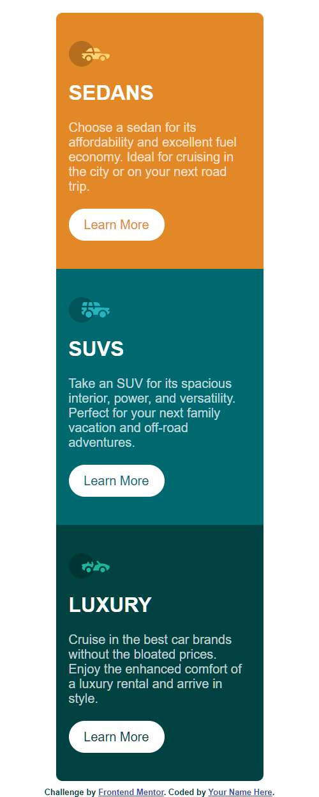
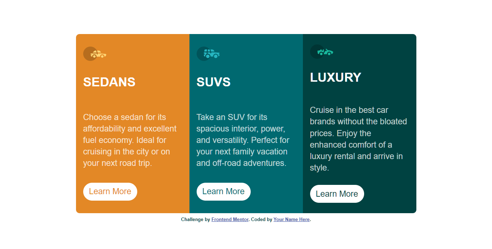

# Frontend Mentor - 3-column preview card component solution

This is a solution to the [3-column preview card component challenge on Frontend Mentor](https://www.frontendmentor.io/challenges/3column-preview-card-component-pH92eAR2-). Frontend Mentor challenges help you improve your coding skills by building realistic projects. 

## Table of contents

- [Overview](#overview)
  - [The challenge](#the-challenge)
  - [Screenshot](#screenshot)
  - [Links](#links)
- [My process](#my-process)
  - [Built with](#built-with)
  - [Continued development](#continued-development)
- [Author](#author)

## Overview
- This has helped to learn layouting.
### The challenge

Users should be able to:

- View the optimal layout depending on their device's screen size
- See hover states for interactive elements

### Screenshot

### Links

- Solution URL: [Add solution URL here](https://your-solution-url.com)
- Live Site URL: [Add live site URL here](https://your-live-site-url.com)

## My process
- I built my semantic html with mobie first approach.
- I carefully picked my class names and utilized the power of css to style my page
- I icorporated flexbox to make layout on big screens
### Built with

- Semantic HTML5 markup
- CSS custom properties
- Flexbox
- Mobile-first workflow

### Continued development

I want to continue to learn more about the mobile first approach and do better designs with CSS and BEM. 

## Author

- Website - [Add your name here](https://www.your-site.com)
- Frontend Mentor - [@jikkeee](https://www.frontendmentor.io/profile/jikkeee)
- Twitter - [@jaekralj](https://www.twitter.com/jaekralj)

